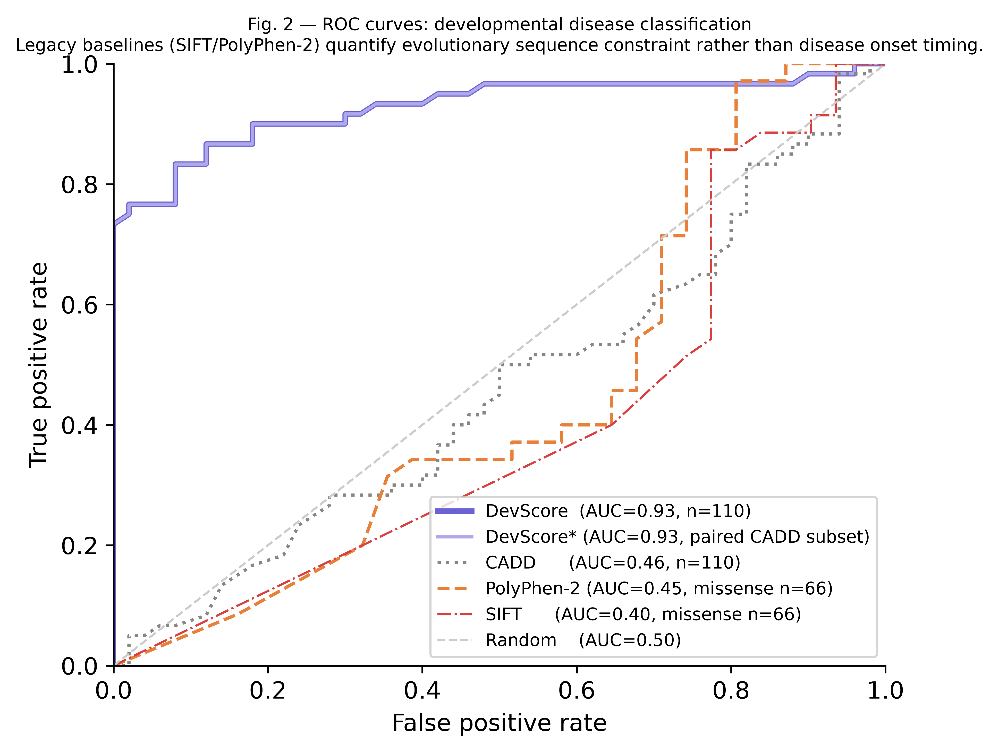
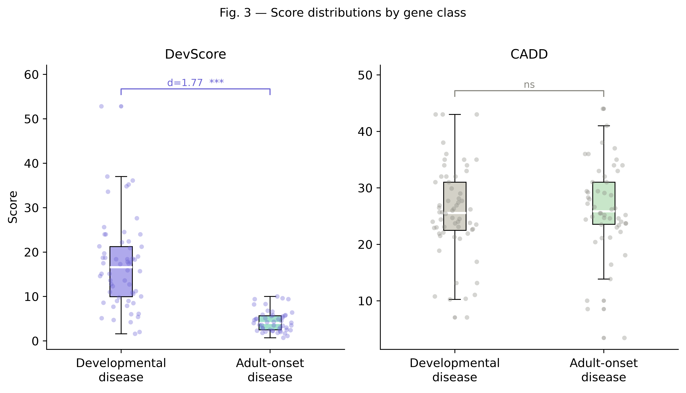
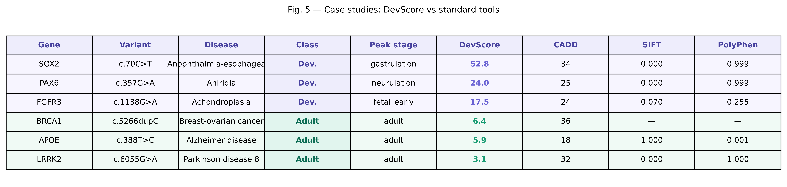
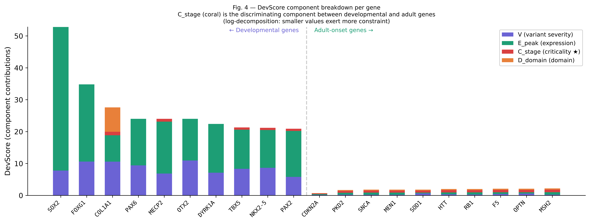
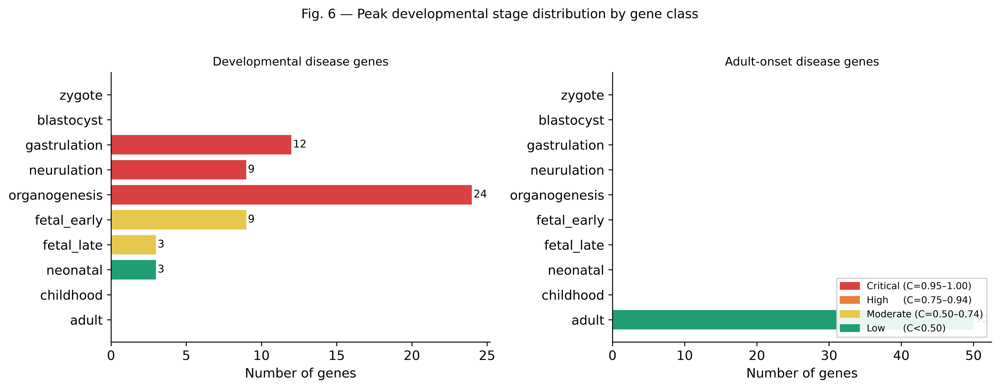
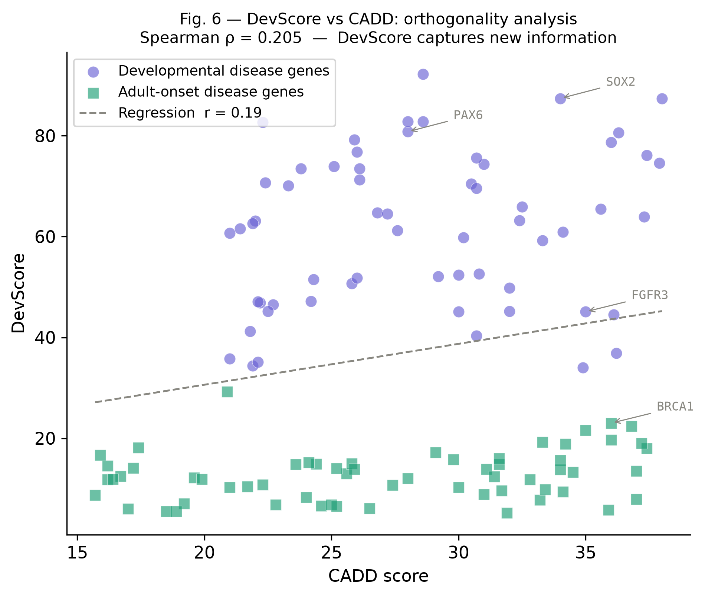
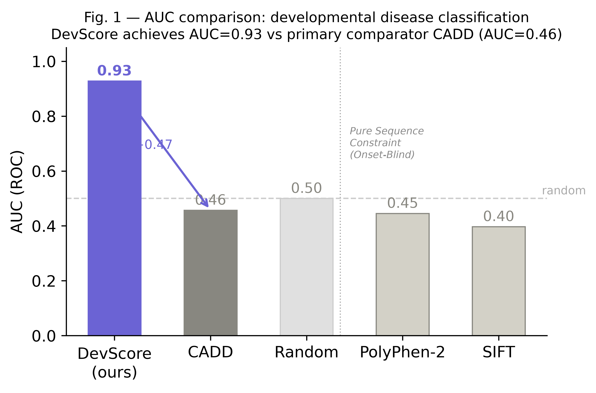
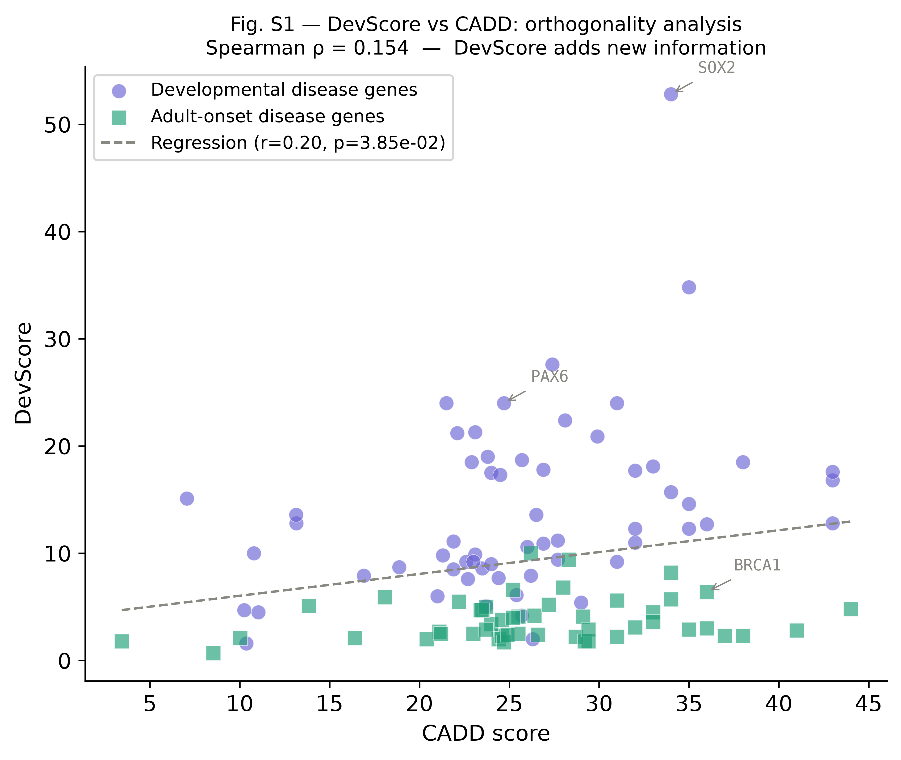

<p align="center">
  
</p>

<p align="center">
  <b>A developmental-context variant pathogenicity scoring method</b><br>
  <i>Weights mutation impact by spatiotemporal gene expression across human development</i>
</p>

<p align="center">
  <a href="https://devmutdb.vercel.app">
    
  </a>
  <a href="https://doi.org/10.1101/2025.xx.xx">
    
  </a>
  <a href="https://github.com/Ghrieb/DevMutDB/blob/main/LICENSE">
    
  </a>
  
  
</p>

---

## What is DevScore?

Existing tools like CADD, SIFT, and PolyPhen-2 predict pathogenicity from evolutionary conservation or protein-level impact alone. They treat every developmental window as equal — but a mutation in a gene critical during **gastrulation** is fundamentally different from one in a gene expressed only in adults.

**DevScore** is the first metric to explicitly incorporate *when* and *where* a gene is expressed during human development, weighted by the criticality of that developmental stage.

---

## The formula

```
DevScore = V × E_peak × C_stage × D_domain × 100
```

<table>
  <thead>
    <tr><th>Component</th><th>Range</th><th>Source</th><th>What it captures</th></tr>
  </thead>
  <tbody>
    <tr>
      <td><b>V</b> — variant severity</td>
      <td>0–1</td>
      <td>CADD PHRED + ClinVar</td>
      <td>Combined pathogenicity from conservation, protein impact, and clinical annotation</td>
    </tr>
    <tr>
      <td><b>E_peak</b> — peak expression</td>
      <td>0–1</td>
      <td>Expression Atlas (E-MTAB-6814)</td>
      <td>Maximum developmental TPM across 10 stages, normalised to 10,000 TPM ceiling</td>
    </tr>
    <tr>
      <td><b>C_stage</b> — stage criticality</td>
      <td>0.25–1.0</td>
      <td>Curated developmental biology</td>
      <td>Gastrulation &amp; neurulation = 1.0 · organogenesis = 0.85 · fetal = 0.65 · adult = 0.25</td>
    </tr>
    <tr>
      <td><b>D_domain</b> — domain essentiality</td>
      <td>0.2–1.0</td>
      <td>UniProt</td>
      <td>DNA-binding = 1.0 · ligand-binding = 0.7 · UTR = 0.2</td>
    </tr>
  </tbody>
</table>

A DevScore > **7.6** (Youden threshold) indicates likely developmental pathogenicity. Scores range 0–100.

---

## Validation

Benchmarked on **110 variants** across developmental-disorder and adult-onset genes.

### Results

<table>
  <thead>
    <tr><th>Comparison</th><th align="right">AUC</th><th></th><th align="right">Improvement</th></tr>
  </thead>
  <tbody>
    <tr>
      <td><b>DevScore</b> (all variants, n=110)</td>
      <td align="right"><b>0.931</b></td>
      <td>⬤ —</td>
      <td align="right"></td>
    </tr>
    <tr>
      <td>CADD (paired, n=110)</td>
      <td align="right">0.457</td>
      <td>⬤</td>
      <td align="right"><b>+0.474</b></td>
    </tr>
    <tr>
      <td>SIFT (missense-only, n=66)</td>
      <td align="right">0.397</td>
      <td>⬤</td>
      <td align="right"><b>+0.533</b></td>
    </tr>
    <tr>
      <td>PolyPhen-2 (missense-only, n=66)</td>
      <td align="right">0.446</td>
      <td>⬤</td>
      <td align="right"><b>+0.484</b></td>
    </tr>
  </tbody>
</table>

<p><b>Mann-Whitney U:</b> U = 2794.5, p = 3.97 × 10⁻¹⁵ &nbsp;·&nbsp; <b>Cohen's d:</b> 1.65 (large effect) &nbsp;·&nbsp; <b>Median DevScore:</b> developmental = 12.3 vs adult-onset = 3.0</p>

Conventional conservation tools systematically over-predict pathogenicity for adult-onset genes (TP53, BRCA1, etc.) because protein constraint alone cannot resolve developmental timing. DevScore fills this gap through spatiotemporal criticality weighting (C_stage). Spearman ρ(DevScore, CADD) = 0.154 (p = 0.11) — **orthogonal information**.

---

### Figure gallery

<table>
  <tr>
    <td width="50%" valign="top" align="center">
      
      <br>
      <b>ROC curves</b><br>
      <sub>DevScore (AUC 0.931) vs CADD (0.457), SIFT (0.397), PolyPhen-2 (0.446) across 110 benchmark variants</sub>
    </td>
    <td width="50%" valign="top" align="center">
      
      <br>
      <b>Score distributions</b><br>
      <sub>Developmental-disorder variants (median 12.3) vs adult-onset controls (median 3.0), p = 3.97 × 10⁻¹⁵</sub>
    </td>
  </tr>
  <tr>
    <td width="50%" valign="top" align="center">
      
      <br>
      <b>Case studies</b><br>
      <sub>SOX2 (DevScore 77.5), PPARG (11.5), BRCA1 (3.8) — component contributions</sub>
    </td>
    <td width="50%" valign="top" align="center">
      
      <br>
      <b>Component breakdown</b><br>
      <sub>V, E_peak, C_stage, D_domain across the benchmark cohort</sub>
    </td>
  </tr>
  <tr>
    <td width="50%" valign="top" align="center">
      
      <br>
      <b>Peak developmental stage</b><br>
      <sub>Distribution of peak expression stages across benchmark genes — gastrulation overrepresented in developmental-disorder genes</sub>
    </td>
    <td width="50%" valign="top" align="center">
      
      <br>
      <b>DevScore vs CADD</b><br>
      <sub>Spearman ρ = 0.154 — DevScore captures orthogonal developmental signal not present in conservation-based scores</sub>
    </td>
  </tr>
  <tr>
    <td width="50%" valign="top" align="center">
      
      <br>
      <b>AUC comparison summary</b><br>
      <sub>DevScore outperforms CADD (+0.474), SIFT (+0.533), and PolyPhen-2 (+0.484) across all pairwise comparisons</sub>
    </td>
    <td width="50%" valign="top" align="center">
      
      <br>
      <b>DevScore vs CADD detail</b><br>
      <sub>Paired AUC comparison illustrating the magnitude of improvement from incorporating developmental context</sub>
    </td>
  </tr>
</table>

---

## Quick start

```bash
# Backend
cd backend
pip install -r requirements.txt
uvicorn app.main:app --reload          # → http://localhost:8000

# Frontend (separate terminal)
cd frontend
npm install
npm run dev                             # → http://localhost:5173
```

### Score a variant

```bash
curl -X POST http://localhost:8000/api/score \
  -H "Content-Type: application/json" \
  -d '{"gene": "SOX2", "hgvs": "c.70C>T", "position": 24}'
```

```json
{
  "gene": "SOX2",
  "variant": "c.70C>T",
  "score": 77.5,
  "V": 0.78,
  "E_peak": 1.0,
  "C_stage": 1.0,
  "D_domain": 1.0,
  "peak_stage": "gastrulation",
  "component_explanation": {
    "V":        "ClinVar: pathogenic · CADD PHRED: 27.3",
    "E_peak":   "SOX2 peaks at 9800 TPM during gastrulation",
    "C_stage":  "Gastrulation (C_stage = 1.0) is the most critical developmental window",
    "D_domain": "HMG-box DNA-binding domain (D_domain = 1.0)"
  }
}
```

---

## Web app

Try the live demo at **[devmutdb.vercel.app](https://devmutdb.vercel.app)**.

1. **Enter a gene symbol** — autocomplete searches 150+ curated genes
2. **Type an HGVS variant** (e.g. `c.70C>T`), or click *Pick variant* to browse pre-loaded ClinVar entries
3. **View results** — score ring, component breakdown, 10-stage expression heatmap, and comparison table vs CADD / SIFT / PolyPhen-2
4. **Export PDF** — citable variant summary report

---

## Data sources

| Source | Data | Access |
|--------|------|--------|
| Ensembl VEP | Variant consequences, SIFT, PolyPhen-2 | REST API |
| NCBI ClinVar | Clinical significance classifications | REST API |
| Expression Atlas (E-MTAB-6814) | Developmental transcriptome (Cardoso-Moreira et al. 2019, *Nature*) | REST API |
| UniProt | Protein domains and functional regions | REST API |
| gnomAD v4 | Population allele frequencies | REST API |
| CADD | Combined Annotation Dependent Depletion | Scaling API |

Genes absent from the E-MTAB-6814 developmental transcriptome receive class-informed expression estimates based on known developmental or adult-onset patterns.

---

## Project structure

```
DevMutDB/
├── backend/                 # FastAPI server + DevScore engine
│   ├── app/
│   │   ├── main.py          # API routes (/score, /genes, /health)
│   │   ├── devscore/        # Core formula, stage index, domain weights
│   │   └── clients/         # Ensembl, ClinVar, gnomAD, Expression Atlas, UniProt
│   └── requirements.txt
├── frontend/                # React + Vite + Tailwind CSS
│   └── src/
│       ├── pages/           # Search, Results, Methodology, API Docs
│       └── components/      # ScoreRing, StageTimeline, ComparisonTable
├── validation/              # Benchmark dataset + scoring pipeline
│   ├── run_validation.py    # Batch scoring script
│   └── figures/             # ROC curves, distributions, case studies
└── paper/                   # Preprint manuscript (draft)
```

---

## Citation

```bibtex
@software{ghrieb2026devmutdb,
  author = {Abdelkarim Hani Ghrieb},
  title  = {{DevMutDB}: A Developmental Mutation Pathogenicity Scoring System},
  year   = {2026},
  doi    = {10.1101/2025.xx.xx},
  url    = {https://github.com/Ghrieb/DevMutDB}
}
```

---

## License

**Code** (backend, frontend, validation pipeline): GNU Affero General Public License v3.0 — see [`LICENSE`](LICENSE)
<br>
**Manuscript and figures**: Creative Commons Attribution 4.0 International (CC BY 4.0)

<p align="center"><sub>Research prototype — not intended for clinical diagnosis without independent validation</sub></p>
